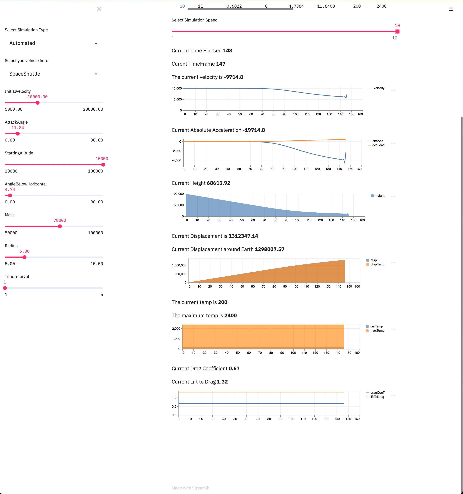

# SpaceShuttleSimulator 🚀 - Land your first space vehicle!
[](https://github.com/SkymanOne/SpaceShuttleSimulator/blob/master/LICENSE)
[](https://github.com/SkymanOne/SpaceShuttleSimulator/issues)
[](https://travis-ci.org/SkymanOne/SpaceShuttleSimulator)



## Description
The project is the first try to program a mathematical model describing the trajectory and other properties of space vehicle during the re-entry into the Earth's atmosphere.

*Simulation.Backend* - a working folder of programmed maths models wrapped up in ASP.NET Core Web API app.

*Simulation.Frontend* - the frontend project in python written using [StreamLit](https://github.com/streamlit/streamlit)

Many thanks to other guys working on the project: Mattie **Lousada Blaazer** and **Will Cliffe**. Materials and ideas used in the project can be seen on the [Miro Board](https://miro.com/app/board/o9J_kqejVvE=/)

Simulation.Backend/Core shouldn't terrify you with its structure. We have kept it as simple as possible but scalable at the same time:
`SpaceVehicle` is inherited by `Shuttle` and `Capsule` (2 types of vehicles you can generally have in rocket science 🙃 )
`SpaceVehicle` contains general equations to calculate different properties and derivations used in further calculations.

`Shuttle` and `Capsule` override `CalculateBallisticCoeff()` and `CalculateLdCoeff()` which are used to calculate Ballistic and Lift-to-Drag coefficients correspondingly as these properties are calculated different for each type of a space vehicle.

During the runtime, after set period of time, the state of a space vehicle is captured and recorded into the `TimeFrame` instance.
When the space vehicle reach the minimum height, the simulation is stopped and the list of `TimeFrame` objects is returned.

## Installation and Usage
No extra libraries are required for c# project. So, just make sure you have got **dotnet 3.1** on your machine.

So, the code can simply be run by:

```bash
cd Simulation.Backend
dotnet restore
dotnet run #runs the web api app
dotnet test #runs tests in Simulation.Tests
```

## License
The whole project is licensed under [MIT](https://github.com/SkymanOne/SpaceShuttleSimulator/blob/master/LICENSE) license. You are more than welcome to make contributions.